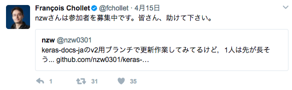
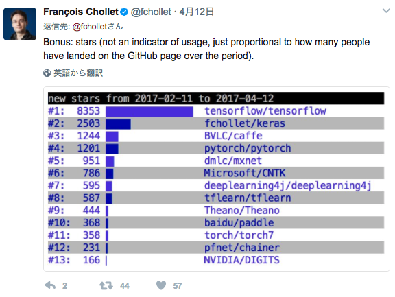

<!-- page_number: false -->

# ようこそPyData.Okinawaへ

## Meetup 24 - TensorFlow Coreで深層学習

Twitter: @PyDataOkinawa (#PyDataOkinawa)

Connpass: http://pydataokinawa.connpass.com/

HP: http://pydata.okinawa

Slack: https://pydataokinawa.slack.com

---
# 本日の予定

| 時間 | 内容 |	スピーカー |
|:------|:------|:-------------|
| 08:55 | 開場 | |
| 09:00-09:20 | PyData.Okinawaについて | PyData.Okinawa オーガナイザー |
| 09:20-09:30 | 自己紹介 | 全員 |
| 09:30-10:00 | LTセッション | ボランティア |
| 10:00-10:45 | TensorFlow Core 入門 | |
| 14:45:-11:00 | 休憩 | |
| 11:00-11:50 | TensorFlow Core ハンズオン | |
| 11:50-12:00 | 次回勉強会について | 全員 |

---

# PyData.Okinawaとは？

Creative Commons BY 2.0:
https://www.happytellus.com/gallery.php?img_id=2668

---

# PyData.Okinawaとは？

Creative Commons BY 2.0
http://free-photo.net/archive/entry5175.html

---

# PyData.Okinawaとは?

- PyData.Okinawa は Python + Data に興味のある方が交流できる沖縄を拠点にしたコミュニティです。
- **データから新しい価値を生み出したいという想い**があれば、どのようなバックグラウンドを持った方でも自由に参加できるオープンなコミュニティです。
- 沖縄で定期的に開催される勉強会では**Pythonをメインな言語として使いますが**、機械学習やデータアナリティクスに興味を持つ方であれば**どのような言語を使うプログラマの方でも参加可能**です。

---

# PyData.Okinawaとは?

- またハードルは高いかもしれませんが、これからPythonプログラミングを覚えたい初心者の方も大歓迎です。
- **沖縄県外のコミュニティとも積極的に交流**しながら、<u>次の世代をインスパイアするような</u>**新しい価値**を生み出していくことが**PyData.Okinawaの成功の姿**です。

**データから始まる
新しい価値を創造するコミュニティ**

---

# PyData.Tokyoとは？

**Python + Data を通じて Pythonistaと データ分析者が交流するコミュニティ**

2014年09月に行われたPyConJP 2014での出逢いをきっかけに、PyData.Tokyoは生まれました。

PyConJP 2014では、データ分析や機械学習関連の発表に非常に大きな関心が寄せられました。一方で、データの分析・可視化をするために必要な知識や技術について、深く議論できるコミュニティやカンファレンスがあればいいのに、という声も耳にしました。そんな想いに応えるべく誕生したのが、PyData.Tokyoです。

---

# PyData.Tokyoとは？

PyData.Tokyoは、多様な分野で活躍しているPythonistaとデータ分析者がバランスよく交流できる、Python + Dataをテーマにしたコミュニティです。

- [PyData.Tokyo Official HP](https://pydata.tokyo/)
- [PyData.Tokyo@connpass](http://pydatatokyo.connpass.com/)

---

# なぜPyData.Okinawaなのか?

- データはこれからどんどん増えていく（IoT、医療、SNS、オープンデータ等）（[link](http://jp.techcrunch.com/2015/05/29/20150528free-dollars-and-fifty-free-cents/)）
- そのデータから価値を引き出せると面白い（次の世代をインスパイアする新しい価値の創造）
- 人とのつながりによる新しい情報や価値観との出会い
- PyData.Okinawaは実験的な場
- 他のコミュニティとの協力体制
- 楽しくなくなったらやめる

---

# PythonBeginners沖縄（仮）

- Python初心者向けのワイワイもくもく会
- http://python-beginners-okinawa.connpass.com/
- 詳細は鈴木さんに v(^^ )

# PythonBeginners沖縄・助け合い所
- [Facebook ページ](https://www.facebook.com/groups/789800504490702/)

---

# PyData.Okinawa News

---

# Sonnet by DeepMind (2017/04/07)

- TensorFlowベースの深層学習用ライブラリ
- https://deepmind.com/blog/open-sourcing-sonnet/
- https://github.com/deepmind/sonnet

---

# Keras2の日本語翻訳作業進行中

---

# 深層学習フレームワーク番付

- https://twitter.com/fchollet/status/852195774880526336
- https://twitter.com/fchollet/status/852196987076300800

---

# The Conversational Intelligence Challenge (2017/04/19)

- ChatBotのガチコンペ
- NIPS2017（2017/12/04-09）で結果発表

https://deeppavlov.github.io/convai/

---

# PyData.Okinawaの決まりごと

## 日時 

* 定期開催（毎月第３土曜日 9:00-12:00）

## 参加費用

- 1500円
- 会場費 & 県外のコミュニティから人を呼んだりするため
- 飲み代ではない
- オーガナイザーも出す

## その他

- 楽しく、クリエイティブに

---

## 自己紹介（ひとり1分ぐらい）

* 名前
* プロフィール（仕事・肩書きなど）

---

## PyData.Okinawaのこれまで (1/5)
- [PyData.Okinawa Meetup #1 - PyData事始め](http://pydataokinawa.connpass.com/event/15567/)
- [PyData.Okinawa Meetup #2 - データ可視化](http://pydataokinawa.connpass.com/event/16388/)
- [PyData.Okinawa Meetup #3 - scikit-learn入門](http://pydataokinawa.connpass.com/event/17652/)
- [PyData.Okinawa Meetup #4 - モデル選択](http://pydataokinawa.connpass.com/event/18396/)
- [PyData.Okinawa Meetup #5 - 復習ミニハッカソン](http://pydataokinawa.connpass.com/event/20225/)

---

## PyData.Okinawaのこれまで (2/5)

- [PyData.Okinawa Meetup #6 - 「データサイエンティスト養成読本：機械学習入門編」読書会 1](http://pydataokinawa.connpass.com/event/20441/) 
  - 第１部　特集１ 機械学習を使いたい人のための入門講座 （よぎさん）
  - 第１部　特集２　機械学習の基礎知識 （ひがさん）
- [PyData.Okinawa Meetup #7 - 「データサイエンティスト養成読本：機械学習入門編」読書会 2](http://pydataokinawa.connpass.com/event/21648/)
    - 第１部　特集２　機械学習の基礎知識 （古川さん）
    - 第２部　特集２ Pythonによる機械学習入門 （岩村さん） 

- [PyData.Okinawa Meetup #8 - 「データサイエンティスト養成読本：機械学習入門編」読書会 3](http://pydataokinawa.connpass.com/event/23825/)　
    - 第２部　特集２ Pythonによる機械学習入門 （岩村さん）
    - 第１部　特集３ビジネスに導入する機械学習 （玉城さん）

---

## PyData.Okinawaのこれまで (3/5)

- [PyData.Okinawa Meetup #9 - 「データサイエンティスト養成読本：機械学習入門編」読書会 4](http://pydataokinawa.connpass.com/event/24769/)
    - 第１部　特集４ 深層学習最前線 （大塚さん）
- [PyData.Okinawa Meetup #10 - 「データサイエンティスト養成読本：機械学習入門編」読書会 5](http://pydataokinawa.connpass.com/event/27214/)　
    - 第２部　特集４ Pythonで画像認識にチャレンジ （ちんさん）
- [PyData.Okinawa Meetup #11 - 「データサイエンティスト養成読本：機械学習入門編」読書会 6](http://pydataokinawa.connpass.com/event/27705/)　
    - 第２部　特集３ 推薦システム入門 （玉城さん）
- [PyData.Okinawa Meetup #12 - 寄り合い](http://pydataokinawa.connpass.com/event/30259/)

 

---

## PyData.Okinawaのこれまで (4/5)

- [PyData.Okinawa Meetup #13 - kaggle](http://pydataokinawa.connpass.com/event/31066/) - Kobe Bryant Shot Selection
- [PyData.Okinawa Meetup #14 - kaggle](http://pydataokinawa.connpass.com/event/32554/) - Shelter Animal Outcomes (Part 1)
- [PyData.Okinawa Meetup #15 - kaggle](http://pydataokinawa.connpass.com/event/34305/) - Shelter Animal Outcomes (Part 2)

---

## PyData.Okinawaのこれまで（5/5）

- [PyData.Okinawa Meetup #16 - kerasで深層学習](http://pydataokinawa.connpass.com/event/36115/) 
- [PyData.Okinawa Meetup #17- Magentaで音楽生成](http://pydataokinawa.connpass.com/event/39806/)
- [PyData.Okinawa Meetup #18 - Pandasでデータ前処理](https://pydataokinawa.connpass.com/event/41618/)
- [PyData.Okinawa Meetup #19 - インタラクティブな可視化](https://pydataokinawa.connpass.com/event/43463/)
- [PyData.Okinawa Meetup #20 - Kerasで時系列学習](https://pydataokinawa.connpass.com/event/46026/)
- [PyData.Okinawa 忘年会 2016](https://pydataokinawa.connpass.com/event/46028/)
- [PyData.Okinawa Meetup #21 - OpenAI Gymで強化学習](https://pydataokinawa.connpass.com/event/46819/)
- [PyData.Okinawa Meetup #22 - OpenAI Universeで深層強化学習](https://pydataokinawa.connpass.com/event/49782/)
- [PyData.Okinawa Meetup #23 - LT大会＆もくもく会](https://pydataokinawa.connpass.com/event/52445/)